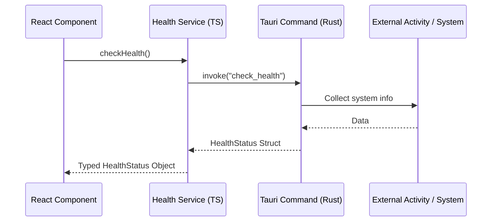

# Integration Architecture (Frontend <-> Tauri Commands)

This documentation describes the architectural pattern for communication between the React frontend and the Tauri Rust backend in LKR Planner.

## Architectural Principles

1. **Clear Separation of Concerns**:
   - **Frontend (React)**: Responsible for UI logic, state management, and user interaction.
   - **Backend (Rust)**: Responsible for network calls (API integrations), filesystem access, secrets, and performance-critical tasks.

2. **Service Facade**:
   - The frontend consumes functionality exclusively through defined **service modules** (`src/services/*.ts`).
   - Service functions encapsulate Tauri's `invoke` calls.
   - Services throw error messages in German for direct display in the UI.

3. **Integration Layer (Rust)**:
   - All integrations (Daylite, Planradar, iCal) are located in `src-tauri/src/integrations/`.
   - Each integration provides type-safe structs and Tauri commands.

## Data Flow (Example: Health Check)



## Folder Structure

- `src/services/`: Frontend service modules (Facade).
- `src-tauri/src/integrations/`: Rust modules for external integrations.
    - `mod.rs`: Central module registration.
    - `health.rs`: Exemplary implementation of a health check.

## Error Handling

- Errors are returned from the Rust backend as `Result<T, String>`.
- The TypeScript service catches errors and normalizes them into an `Error` instance with a user-friendly (German) message.

```typescript
export async function someAction(): Promise<ResultType> {
  try {
    return await invoke<ResultType>("some_command");
  } catch (error) {
    throw new Error(`Action failed: ${error}`);
  }
}
```
